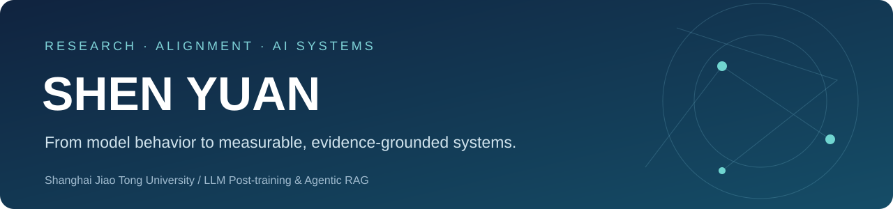

<p align="center"></p>

# 沈愿 · Shen Yuan

**LLM Post-training / Voice Agent / Full-Duplex Spoken AI / Agentic Systems**

我关注大模型如何从“能生成答案”进一步走向真实业务中的**可交互、可决策、可训练与可评测系统**。

近期主要围绕三个方向展开：

- **Voice Agent 与拟人化交互**：研究销售型语音 Agent 的策略规划、自然表达与实时交互；
- **全双工语音模型**：关注 Turn-taking、Backchannel、Interrupt、EOT 与端到端 Full-Duplex Spoken LLM；
- **LLM Post-training & Agent**：实践 SFT、DPO、PPO/RL、RAG、Tool Agent 与可验证评测。

我更关注一个模型为什么有效、什么时候失效，以及如何通过数据、训练、评测和工程系统把这些问题真正定位出来。

[GitHub](https://github.com/Shenyyyuan) · [Email](mailto:shenyuan001@sjtu.edu.cn)

---

## Current Focus

### 01 / Full-Duplex Spoken Language Model · 业务语音适配与训练

正在研究端到端全双工语音交互，并复现 **Lychee-FD** 框架及论文评测流程。

目前工作重点是将真实 AI 外呼业务数据转化为可训练的全双工数据：

`业务录音 → 音频下载 → 双声道/ASR 对齐 → Turn / Overlap / Backchannel / Interrupt 标注 → 数据清洗 → Lychee-FD 训练`

当前正在推进业务录音数据下载与数据 Pipeline 搭建；后续计划使用业务语音数据对 Lychee-FD 进行训练与适配，并从两个层面验证效果：

- **模型指标**：Turn-taking、Backchannel、Interruption 等全双工能力；
- **业务指标**：响应延迟、打断体验、对话自然度与业务交互效果。

**重点研究问题**：8 kHz 电话音频如何适配 16 kHz Speech Tokenizer？Overlap 为什么不等于 Interrupt？Backchannel 如何标注与评测？端到端全双工相比 ASR→LLM→TTS 能解决哪些实时交互问题？

---

### 02 / Voice Agent · 面向 AI 外呼的实时销售 Agent

围绕保险 AI 外呼，探索从传统 **Prompt + RAG** 向具备状态、策略与工具能力的 Voice Agent 演进。

系统将销售行为抽象为：

`Objective → Task → Action → Tool`

并采用 **Reasoner / Talker 快慢 Agent**：

- **Reasoner**：后台维护客户状态、产品选择、Task 与 Tool Call；
- **Talker**：低延迟生成当前轮 `<Action Token> + 口语回复`；
- **Action Token**：作为策略可观测接口，用于 Trace、Replay、质检及后续训练；
- **Tool**：负责短信、产品链接等真实业务动作，并与自然语言生成隔离。

同时探索实时语音链路中的 ASR、Turn Detection、TTS Streaming 与用户打断处理。

**重点研究问题**：如何在深度策略推理与语音低延迟之间取舍？异步 Slow Agent 的策略陈旧如何控制？如何把多轮销售行为结构化成可训练的 Action Space？

---

### 03 / Human-like AI Outbound · 场景化拟人表达后训练

面向保险 AI 外呼，研究语言模型在不同销售场景下“**应该说多少、怎么说**”。

基于 **Qwen3.6-27B + LoRA SFT**，从线上 AI 外呼日志构建六类场景约 2.8k 条重写数据，针对：

- 口语自然度
- 上下文承接
- 信息密度
- 回复长度与场景匹配

进行训练与评测。

实践中发现：简单地让模型“更短、更口语”会导致产品与价格解释信息不足；专项 DPO 实验又出现口语风格回退，因此进一步将场景差异直接落实到数据构造与评测标准中。

DeepSeek V4 Pro 四维评测均分由 **5.36 提升至约 7.5 / 10**；业务前后观察中，平均挂断轮次增加约 **4–5 轮**，客户明确怀疑 AI 身份的会话占比相对下降约 **26%**。

**重点研究问题**：为什么 SFT Loss 很低不代表业务效果好？为什么 DPO 可能造成风格回退？如何避免模型把“拟人化”错误地学习成单纯缩短回复？

---

## Selected Projects

### 04 / [DeepResearch · Verifiable Tool Agent & Post-training](https://github.com/Shenyyyuan/DeepResearch)

研究多跳问答中的证据选择、工具使用、轨迹学习与奖励设计。

构建可重放的：

`Search → Reader → Agent → Verifier`

环境，并围绕 SFT、DPO、PPO、GAE 与 Reward Design 搭建后训练实验框架。

关注的问题包括：

- 引用正确为什么仍然可能答错？
- SFT loss 已经很低，为什么 Agent 行为仍然失败？
- 如何避免错误 Reward 放大已有策略缺陷？
- 如何将工具调用轨迹转化为可训练数据？

[方法与实验](https://github.com/Shenyyyuan/DeepResearch#2-方法) ·
[训练实现](https://github.com/Shenyyyuan/DeepResearch/tree/main/src/alignment) ·
[验证记录](https://github.com/Shenyyyuan/DeepResearch/tree/main/reports)

---

### 05 / [MedicalGPT · Domain Post-training & Safety Evaluation](https://github.com/Shenyyyuan/MedicalGPT)

基于开源 MedicalGPT 开展领域后训练与偏好学习实验。

围绕医疗数据质量、Preference Pair、DPO 与自动 Judge 偏差，补充分组清洗、安全标注契约、训练入口及配对统计评测。

关注的问题包括：

- 如何避免“总是拒答”获得虚假的安全提升？
- Reward Model Accuracy 与 Win Rate 分别衡量什么？
- 如何识别 LLM Judge 的长度偏差？
- 如何区分领域能力提升与回答风格变化？

[贡献边界](https://github.com/Shenyyyuan/MedicalGPT/blob/main/docs/CONTRIBUTIONS.md) ·
[评测协议](https://github.com/Shenyyyuan/MedicalGPT/blob/main/docs/EVALUATION_PROTOCOL.md) ·
[新增实现](https://github.com/Shenyyyuan/MedicalGPT/tree/main/src/medical_alignment)

---

### 06 / [RAG Workflow · Retrieval & Agentic RAG](https://github.com/Shenyyyuan/rag-workflow)

实现从文档入库到多阶段生成的完整 RAG Pipeline：

`Chunking → Embedding → FAISS / BM25 → RRF → Reranker → Generation`

进一步实现：

- Parent-Child Retrieval
- CrossEncoder Reranking
- HyDE
- Corrective Retrieval
- Reflection
- Multi-stage Agent Workflow

并通过逐题实验同时比较检索质量、生成质量与时延，而不是只观察最终回答。

[系统与决策](https://github.com/Shenyyyuan/rag-workflow#4-技术决策) ·
[逐题实验](https://github.com/Shenyyyuan/rag-workflow/blob/main/reports/retrieval_bge.json) ·
[高级 RAG](https://github.com/Shenyyyuan/rag-workflow/tree/main/src/advanced_rag)

---

## How I Approach Engineering

- **先定义问题，再选择模型**  
  区分数据问题、模型问题、策略问题、检索问题与系统问题，而不是把所有 Bad Case 都归因于“大模型能力不够”。

- **把行为变成可观测变量**  
  不只保存最终文本，也关注 Task、Action、Tool、Reward、Trace 与用户下一步行为。

- **让训练与评测闭环**  
  从 Bad Case → 数据构造 → SFT / Preference Learning → 离线评测 → 业务指标 → 新 Bad Case。

- **同时关注模型与系统指标**  
  Accuracy / Reward 之外，也关注 TTFT、Time-to-first-audio、P95 延迟、打断、重复率与真实业务反馈。

- **区分事实、实验结果与假设**  
  已完成、实验观察与后续规划分别陈述，不用未来工作包装当前结果。

---

## Technical Focus

| Direction | Stack / Topics |
|---|---|
| LLM Post-training | PyTorch, Transformers, PEFT / LoRA, SFT, DPO, PPO, GRPO, Reward Modeling |
| Voice & Speech | Full-Duplex SLM, Lychee-FD, ASR, TTS, Speech Tokenizer, VAD, EOT, Turn-taking, Backchannel, Interruption |
| Voice Agent | Reasoner / Talker, Objective-Task-Action, Tool Calling, Memory, Trace, Realtime Interaction |
| Retrieval & Agents | FAISS, BM25, RRF, BGE, CrossEncoder, LangGraph, Agentic RAG |
| Data & Evaluation | Python, SQL, Data Pipeline, LLM Judge, Replay Evaluation, A/B Testing |

---

## What I Am Exploring Now

```text
Full-Duplex Speech
        │
        ├── Business audio download & preprocessing
        ├── 8 kHz → 16 kHz speech adaptation
        ├── Turn / BC / Interrupt annotation
        ├── Lychee-FD business-data training
        └── Model metrics × Business metrics

Voice Agent
        │
        ├── Reasoner / Talker
        ├── Task & Action Space
        ├── Tool / Memory / Trace
        ├── Realtime speech interaction
        └── SFT → Preference Learning → RL

LLM Post-training
        │
        ├── Data
        ├── SFT
        ├── DPO / PPO / GRPO
        ├── Reward & Verifier
        └── Evaluation
